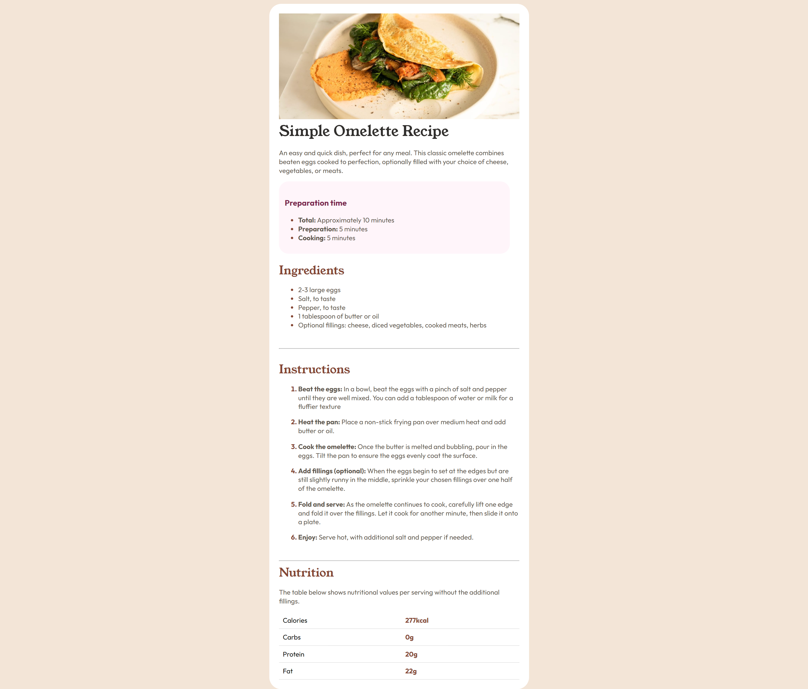

## Table of contents

- [Overview](#overview)
  - [Screenshot](#screenshot)
- [My process](#my-process)
  - [Built with](#built-with)
  - [What I learned](#what-i-learned)
  - [Continued development](#continued-development)
- [Author](#author)

## Overview
This is a recipe page for an omelette recipe created using HTML and CSS.

### Screenshot

## My process

### Built with

- Visual Studio Code

### What I learned

I was able to deepen my knowledge of working with boxes and tables. I am happy with how this project has turned out. I am looking forward to creating more projects.

### Continued development

I want to continue working with fonts and images in future projects

## Author

- Website - [Ria](https://aayrt4.github.io/)
